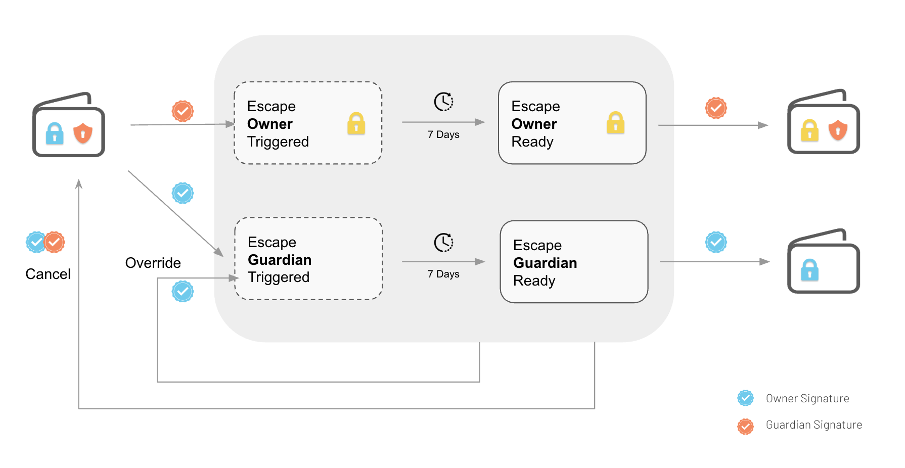

# Escape Process (Recovery)

The escape process allows the guardians to request a change of the account owners. If the request is not challenged during a security period, the new owner requested by the guardians will be set as the new account owner.

The process also works the other way around, where the owners can request a change (or removal) of the guardians

The main benefits of the escape process are:

* Allows the guardians to recover the account **if the owner keys are lost**. Without the guardians, the account would be lost if the owner keys are lost.
* Allows the owners to remove/change the guardians if they are not cooperating. Bringing **censorship resistance** to the account

The escape process is asymmetric in favor of the owners who can override an escape triggered by a guardian. That ensures that the guardians can't take control of the account without the owners approval. Adding multiple guardians can also be used as the as the ultimate censorship resistance guarantee.

Guardians and the escape process can protect against lost owner keys and against compromised owners. But they can't protect against a scenario where ALL owner keys are lost AND one owner key is compromised at the same time. For that reason, we recommend that at least one owner key is always backed up.

## Process

An escape can be **triggered** by one role (owner or guardian), requesting to modify the other role (`trigger_escape_guardian` or `trigger_escape_owner`). This kicks off a security period where many things can happen:

* Both roles agree on a transaction to resolve the situation. Calling methods that will **cancel the escape**. For instance: `cancel_escape`, `change_guardians`, `change_owners`, `upgrade`.
* The other role can trigger a **new escape** to prevent the escape: For instance, if a malicious guardian requested to change the owners. The owner can trigger a new escape to remove the guardian.
* The **security period elapses** with no further actions. The escape is then active.
  * When the escape is active, the same role that triggered it can **complete the escape** by calling `escape_guardian` or `escape_owner`. The account **owners or guardians will be replaced** by the new owners or guardians requested when the escape was triggered.
  * The escape can also be **cancelled** by both roles **or overridden** by a new escape.
  * If the escape is not completed during another security period, the escape will **expire** and it will be like if the escape was never triggered

The default security period is **7 days** but it can be changed by the user.

The following diagram shows the escape process in a simplified way. The blue checkmark represents an owner signature, the orange one a guardian signature.

<figure><figcaption>
Escape Process
</figcaption></figure>

## Escape Methods

When the account has guardians most transactions require the approval of both roles, one owner and one guardian. The only exception are the 4 methods that can be used on escapes:

* Calling `trigger_escape_guardian` or `escape_guardian` Requires a signature from just one of the owners
* Calling `trigger_escape_owner` or `escape_owner` Requires a signature from just one of the guardians

| Action                    | Owner Signature Required | Guardian Signature Required |
| ------------------------- | ------------------------ | --------------------------- |
| `trigger_escape_guardian` | Yes                      | No                          |
| `escape_guardian`         | Yes                      | No                          |
| `trigger_escape_owner`    | No                       | Yes                         |
| `escape_owner`            | No                       | Yes                         |
| ANY OTHER METHOD          | Yes                      | Yes                         |

## Multiple owners and guardians

When the account has multiple owners and/or multiple guardians, the escape process behaves as follows:

* When an owner escape is completed: ALL the owners are replaced by the single new owner specified in the escape
* When a guardian escape is completed: ALL the guardians are replaced by the a new guardian specified in the escape. If no new guardian is specified, all the guardians are removed

## Gas griefing

Even if one leaked key can't compromise the account (because the real owners/guardians can replace the leaked key), the key can be used to trigger multiple transactions using the escape methods in order to spend on fees, draining the account.

In order to prevent it, the account doesn't allow owners and guardians to submit multiple transactions quickly (only one every 12h), and also it imposes limits on how much a single transaction can spend.
