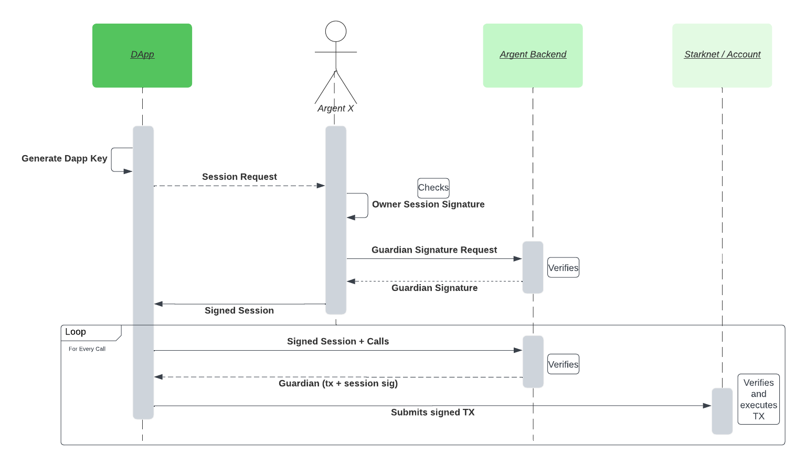

# Sessions

Sessions allow dapps to submit transactions on behalf of the user without requiring any user interaction, as long as the transaction to execute follows some restrictions defined when the session is created. This will allow for a better UX in areas such a gaming

This feature is only available to argent accounts where there's a guardian

Many of these restrictions are guaranteed onchain by the contract but others could rely on the account guardian.

In order to start a session a dapp must generate a key pair (dapp key), and request the account to sign an offchain message with the session parameters.

If the message is signed, then the dapp can trigger transactions without the need for user interactions using the session signed in the previous step - plus a guardian and a dapp key signature for every new transaction



### Offchain checks by guardian:

- Session expiration
- Anything included in the `Metadata` field

### Onchain checks by the account:

- Methods to call
- Backend and dapp signatures
- Check if session is revoked (see [Session Revocation ](#session-revocation))
- Session expiration: it can only be done with some level precision during validation because of starknet restrictions to timestamps during validation, but the check will be also performed on execution with a more accurate timestamp. This could allow the dapp to perform some gas griefing but it is mitigated by the fact the guardian is also performing the check offchain

### Session revocation:

Session revocation is done via the `revoke_session` function, which accepts the hash of the session request. A SessionRevoked event is emitted once this happens. There is also a view method that can be used, `is_session_revoked` which returns a bool for a given session hash

```rust
/// Event emitted on revocation
struct SessionRevoked {
  session_hash: felt252,
}

/// Method to revoke a session
fn revoke_session(session_hash: felt252)

/// Method to check is a session is revoked
fn is_session_revoked(session_hash: felt252) -> bool

/// Check if the authorization signature is cached for a given session
fn is_session_authorization_cached(self: @ComponentState<TContractState>, session_hash: felt252) -> bool
```

### Session Caching

The dapp may choose to enable caching to reduce the transaction costs of a session (in cases where the owner is a signer more expensive than the starknet key). The SessionToken struct accepts a bool flag `cache_authorization`, if set to true, the first session call will be verified as normal except the `session_authorization` signature verification will be cached, subsequent transactions can then bypass this signature verification check thus benefiting from the reduced cost of verifying the session calls. Sending an empty `session_authorization` array (if the verification has previously been verified and cached), may also further reduce costs by reducing the overall calldata size. For fee estimations, its advised to estimate as if a `session_authorization` signature will be given (non-empty) to ensure the transaction wont fail.

There is also a view method `is_session_authorization_cached` which returns a bool for a given session hash.

```rust
/// Check if the authorization signature is cached for a given session
fn is_session_authorization_cached(self: @ComponentState<TContractState>, session_hash: felt252) -> bool
```

### Signature format

To use sessions, the tx signature should start with `SESSION_MAGIC` followed by the serialized SessionToken. Where `SESSION_MAGIC` is the shortstring `session-token`

```rust
struct SessionToken {
  /// Data of the session signed during creation
  session: Session,
  /// Flag indicating whether to cache the authorization signature for the session
  cache_authorization: bool
  /// the owner and guardian session signatures from the session creation phase
  session_authorisation: Span<felt252>,
  /// the session key signature over poseidon(transaction_hash, session_hash)
  session_signature: SignerSignature,
  /// the session key signature over poseidon(transaction_hash, session_hash)
  guardian_signature: SignerSignature,
  /// a proof for each call to execute
  proofs: Span<Span<felt252>>,
}

struct Session {
  expires_at: u64,
  allowed_methods_root: felt252,
  metadata_hash: felt252,
  session_key_guid: felt252,
}
```

### Offchain message example

```typescript
{
  types: {
    StarknetDomain: [
      { name: 'name', type: 'shortstring' },
      { name: 'version', type: 'shortstring' },
      { name: 'chainId', type: 'shortstring' },
      { name: 'revision', type: 'shortstring' }
    ],
    'Allowed Method': [
      { name: 'Contract Address', type: 'ContractAddress' },
      { name: 'selector', type: 'selector' }
    ],
    Session: [
      { name: 'Expires At', type: 'timestamp' },
      {
        name: 'Allowed Methods',
        type: 'merkletree',
        contains: 'Allowed Method'
      },
      { name: 'Metadata', type: 'string' },
      { name: 'Session Key', type: 'felt' }
    ]
  },
  primaryType: 'Session',
  domain: {
    name: 'SessionAccount.session',
    version: '1',
    chainId: 'SN_SEPOLIA',
    revision: '1'
  },
  message: {
    'Expires At': '117090256870',
    'Allowed Methods': [
      {
        'Contract Address': '0x3f68e12789ace09d195ba1a587550c19dbd665b7bd82da33b08ac83123db652',
        selector: 'set_number_double'
      }
    ],
    Metadata: '{ "projectID": "123456", "maxFee": 1000000000000, "feeToken": "STRK", "tokenLimits" : { "0x989898989" : 9999999999 } }',
    'Session Key': '2543707029695183230146761574221281240112511463954890350766793321580039814416'
  }
}
```

### Examples

There are some examples in typescript about how to use this feature [here](../lib/session/) and [here](../tests-integration/sessionAccount.test.ts)
