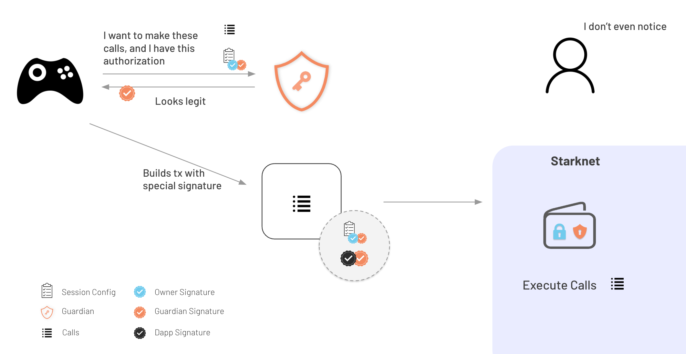

# Sessions

Sessions allow dapps to submit transactions on behalf of the user without requiring any user interaction, as long as the transaction to execute follows some restrictions defined when the session is created. This will allow for a better UX in areas such as gaming

This feature is only available to argent accounts where there's a guardian

Many of these restrictions are guaranteed onchain by the contract but others could rely on an account guardian.

## Flow

In order to **create a session** a dapp must generate a key pair (dapp key), and request the wallet to sign an offchain message with the session parameters. The resulting signature is called the **"Session Authorization"**, and it includes a signature from one owner and one guardian.


To **use a session** the dapp will need to trigger a transaction using the session signed in the previous step. Also a guardian and a dapp key signature will need to sign again for every transaction. They will sign over the following hash: `poseidon(transaction_hash, session_hash, cache_owner_guid)`
Note that the user is not involved in the process.



### Onchain checks by the account:

- Methods to call (contract address and selector)
- Guardian and dapp signatures for every transaction (Guardian must be the same as the one used in the session authorization)
- Check if session is revoked (see [Session Revocation ](#session-revocation))
- Session expiration: it can only be done with some level precision during validation because of starknet restrictions to timestamps during validation, but the check will be also performed on execution with a more accurate timestamp. This could allow the dapp to perform some gas griefing but it is mitigated by the fact a guardian is also performing the check offchain

### Offchain checks by guardian:

- Session expiration (with higher accuracy than the onchain check)
- Anything included in the `Metadata` field (it could include checks to make sure the dapp is not expending too much on gas fees)

### Sessions and multiple guardians

Sessions can now be used with **ANY guardian**. The account checks that the Session Token is signed by the same guardian used in the authorization, but a second guardian can also sign the authorization. So the wallet or the user can't enforce that a specific guardian is used for a given session.

### Session revocation:

Session revocation is done via the `revoke_session` function, which accepts the hash of the session request. A SessionRevoked event is emitted once this happens. There is also a view method that can be used, `is_session_revoked` which returns a bool for a given session hash

```rust
/// Event emitted on revocation
struct SessionRevoked {
  session_hash: felt252,
}

/// Method to revoke a session
fn revoke_session(session_hash: felt252)

/// Method to check is a session is revoked
fn is_session_revoked(session_hash: felt252) -> bool
```

### Session Caching

The dapp may choose to enable caching to **reduce the transaction costs** of a session. It's especially interesting in cases where the owner who signed the authorization is a signer more expensive than the starknet key, like a WebAuthn Signer.

The SessionToken struct accepts a `cache_owner_guid: felt252`. Caching is not enabled if `cached_owner_guid` is set to 0. Otherwise, the field should contain the guid of the owner who signed the authorization. and in the **first session call**, the **authorization will be verified** as normal except the `session_authorization` signature verification will be cached in storage, **subsequent transactions** can then **bypass the authorization** check thus benefiting from a **reduced cost**. Moreover, after the first transactions, the dapps can send an empty `session_authorization` array which reduces costs further by shrinking the signature size.

When doing a fee estimation, its advised to estimate as if the `session_authorization` is present to ensure the transaction wont fail even if some malicious party modifies the signature fill in the session authorization

There is also a view method `is_session_authorization_cached` which returns a bool for a given session hash owner and guardian.

Even if the authorization is cached. The account will **stop accepting a cached authorization if the owner or the guardian who signed it are not longer valid** in the account. That way the behavior is the same wether caching is used or not.

See the notes about the breaking changes in version 0.5.0 [here](#history)

### Signature format

To use sessions, the tx signature should start with `SESSION_MAGIC` followed by the serialized SessionToken. Where `SESSION_MAGIC` is the shortstring `session-token`

```rust
struct Session {
  // Timestamp when the session becomes invalid
  expires_at: u64,
  // Merkle root of allowed methods
  allowed_methods_root: felt252,
  // Hash of the session metadata JSON string
  metadata_hash: felt252,
  // GUID of the session key
  session_key_guid: felt252,
}

// Container for session data and signatures needed to execute a given transaction
struct SessionToken {
  // The session configuration
  session: Session,
  // GUID of the owner that signed the `session_authorization`, or 0 to skip caching
  cache_owner_guid: felt252,
  // Signatures from one owner and one guardian over the session. It can be empty if the session is cached
  session_authorization: Span<felt252>,
  // Session key's signature over poseidon(tx_hash, session_hash, cache_owner_guid)
  session_signature: SignerSignature,
  // A guardian's signature over poseidon(tx_hash, session_hash, cache_owner_guid). The guardian signing here must be the same guardian used in the authorization
  guardian_signature: SignerSignature,
  // Merkle proofs for the transaction calls
  proofs: Span<Span<felt252>>,
}
```

### Offchain message example

```typescript
{
  types: {
    StarknetDomain: [
      { name: 'name', type: 'shortstring' },
      { name: 'version', type: 'shortstring' },
      { name: 'chainId', type: 'shortstring' },
      { name: 'revision', type: 'shortstring' }
    ],
    'Allowed Method': [
      { name: 'Contract Address', type: 'ContractAddress' },
      { name: 'selector', type: 'selector' }
    ],
    Session: [
      { name: 'Expires At', type: 'timestamp' },
      {
        name: 'Allowed Methods',
        type: 'merkletree',
        contains: 'Allowed Method'
      },
      { name: 'Metadata', type: 'string' },
      { name: 'Session Key', type: 'felt' }
    ]
  },
  primaryType: 'Session',
  domain: {
    name: 'SessionAccount.session',
    version: encodeShortString("1"),
    chainId: chainId,
    revision: 1
  },
  message: {
    'Expires At': '117090256870',
    'Allowed Methods': [
      {
        'Contract Address': '0x3f68e12789ace09d195ba1a587550c19dbd665b7bd82da33b08ac83123db652',
        selector: 'set_number_double'
      }
    ],
    Metadata: '{ "projectID": "123456", "maxFee": 1000000000000, "feeToken": "STRK", "tokenLimits" : { "0x989898989" : 9999999999 } }',
    'Session Key': '2543707029695183230146761574221281240112511463954890350766793321580039814416'
  }
}
```

### Sessions and Outside Execution

Session can also be used in conjunction with [Outside Execution](./outside_execution.md). This can for instance allow subsidized sessions transactions or fee payment in other tokens.

### Examples

There are some examples in typescript about how to use this feature [here](../lib/session/) and [here](../tests-integration/sessionAccount.test.ts)

### History

Sessions were introduced in version 0.4.0 of the Argent Account.

There are some changes in version 0.5.0

- **Caching**:

  The `SessionToken`field `cache_authorization: bool` was replaced by `cache_owner_guid: felt252` in version 0.5.0.
  Cache is still disabled if `cache_owner_guid` is set to 0, but passing `0x1` (true) won't work starting from version 0.5.0. Instead, the SessionToken should include the GUID if the owner who signed the session authorization.

  Note this also means that both dapp and guardian will now sign every transaction over: `poseidon(transaction_hash, session_hash, cache_owner_guid)` where they use to use the cached_authorization bool instead

  The `is_session_authorization_cached(...)` method now needs to be called with the owner and the guardian GUIDs

- Sessions can now be used with **ANY guardian**. In the previous versions sessions were restricted to the MAIN guardian. The account checks that the Session Token is signed by the same guardian used in the authorization, but a second guardian can also sign the authorization. So the wallet or the user can't enforce that a specific guardian is used for a session.
